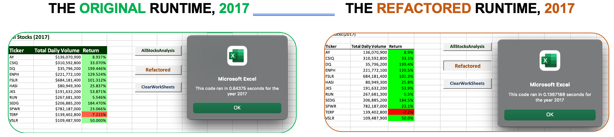
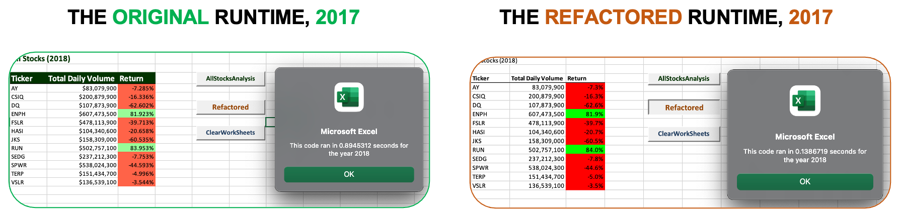

# STOCK-ANALYSIS

## `-Indice-`

- [Overview](#overview-of-project)
- [Results](#results)
  - [ComparingStock](#Comparing-the-stock-performance)
  - [ComparingTimes](#Comparing-the-execution-times)
- [Summary](#summary)

## `Overview of Project`

In the prepared workbook for Steve, he can analyze an entire dataset at the click of a button. Now, he wants to expand the dataset to include the entire stock market over the last few years and he is wondering how much time it takes to calculate data for one year. So, the purpose of the project is to compare 12 stock performances in 2017 and 2018 as well as refactor code to improve runtime of calculation.

## `Results`

### Comparing the stock performance

Based on analysed data to compare the stock performance between 2017 and 2018 there are few things.
Firstly, the 2017 was the most successful year for all markets except TERP which lost about 7% of their cost.

Also, that is evidence that for DQ the biggest success in 2017 with almost 200% of the growth. However, in the 2018 the price of DQ dropped by -62.6%. The most reliable is ENPH stock which constantly growing besides some collapse for others in 2018.

Additionally, the riskiest with high volunteering is SPWR. They earned less in the successful year and lost more than average in the collapsed year.

Furthermore, in 2017 and 2018 the most failed is TERP and on the contrary the most successful is RUN which returned 84% in the collapsed year. 

### Comparing the execution times

To compare the execution times of the original script and the refactored script that is evidance that by refactoring the code, the script run faster. Let's visualize it.

## `Summary`

### a.

What are the advantages or disadvantages of refactoring code? (to avoid copying the same lines 12 times to get the results of 12 stock ). There is a detailed statement on the advantages and disadvantages of refactoring code in general.

### b.

! How do these pros and cons apply to refactoring the original VBA script? There is a detailed statement on the advantages and disadvantages of the original and refactored VBA script.
